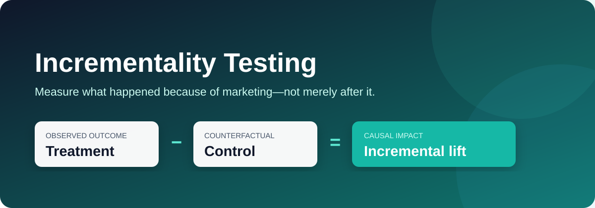

<p align="center">
  
</p>

# Incrementality Testing

Practical Python case studies for measuring the outcomes **caused by** marketing. The repository moves from randomized customer holdouts to geo experiments and segment-level treatment effects, then connects those results to broader marketing measurement and budget decisions.

## Why incrementality matters

Attribution asks which touchpoint received credit. Incrementality asks a harder and more valuable question:

> What would have happened if the marketing intervention had not occurred?

The answer is a counterfactual. A credible control group, matched market, or quasi-experimental design estimates that missing outcome.

$$\text{Incremental lift}=E[Y\mid T=1]-E[Y\mid T=0]$$

Observed revenue alone can overstate impact because high-intent customers may have purchased anyway. Incrementality separates genuinely caused outcomes from baseline demand.

## Case studies

| Case study | Design | Business question | Main output |
|---|---|---|---|
| [`randomized_holdout.py`](case_studies/randomized_holdout.py) | Customer-level randomized controlled trial | Did the campaign create additional conversions and revenue? | Absolute/relative lift, confidence interval, p-value, incremental revenue |
| [`geo_incrementality.py`](case_studies/geo_incrementality.py) | Treated market with matched control | Did regional media increase sales beyond the expected counterfactual? | Weekly counterfactual, total lift, relative lift |
| [`segment_incrementality.py`](case_studies/segment_incrementality.py) | Randomized test with heterogeneous effects | Which customer segments respond incrementally? | Segment lift and targeting priorities |

All examples generate synthetic data with fixed random seeds. They are safe to run, reproducible, and easy to replace with real experiment data.

## Quick start

```bash
git clone https://github.com/JCZY999/Incrementality-Testing.git
cd Incrementality-Testing
pip install -r requirements.txt

python case_studies/randomized_holdout.py
python case_studies/geo_incrementality.py
python case_studies/segment_incrementality.py
```

Each script writes analysis tables and a chart to its own folder under `outputs/`.

## Case study 1: randomized customer holdout

### Scenario

An eligible customer audience is randomly split between campaign treatment and no-contact control. The primary outcome is conversion; revenue is a secondary outcome.

```python
treatment = rng.binomial(1, 0.5, n_customers)
converted = rng.binomial(1, baseline_probability + treatment_effect)

absolute_lift = treatment_rate - control_rate
relative_lift = absolute_lift / control_rate
incremental_conversions = absolute_lift * treated_customers
```

### Reproducible result

| Metric | Result |
|---|---:|
| Control conversion | 24.83% |
| Treatment conversion | 28.16% |
| Absolute lift | 3.32 percentage points |
| Relative lift | 13.37% |
| 95% confidence interval | 2.10–4.54 points |
| Estimated incremental conversions | 334 |
| Estimated incremental revenue | $28,249 |

### Decision

The treatment produces statistically and commercially meaningful lift. Scale only after subtracting campaign cost and checking guardrails such as unsubscribes and margin.

## Case study 2: geo incrementality

### Scenario

A regional media campaign launches after 16 pre-period weeks. A matched control market predicts what treated-market sales would have been without the campaign.

```python
slope, intercept = np.polyfit(pre.control_sales, pre.treated_sales, 1)
weekly_counterfactual = slope * control_sales + intercept
incremental_sales = treated_sales - weekly_counterfactual
```

### Reproducible result

| Metric | Result |
|---|---:|
| Test-period incremental sales | 1,537 |
| Average weekly lift | 192 |
| Relative lift | 13.4% |

### Decision

The treated market outperforms its modeled counterfactual during the test period. Before scaling, validate pre-period fit, absence of spillovers, comparable promotions, and stable market relationships.

## Case study 3: segment-level incrementality

### Scenario

A campaign may work differently across customer groups. This example borrows the audience language from the [Customer Segmentation project](https://github.com/JCZY999/Customer_Segmentation) and estimates lift separately inside each randomized segment.

| Segment | Interpretation from the simulation |
|---|---|
| Affluent but Unengaged | Largest relative response; strong activation candidate |
| Core Customers | Meaningful absolute and relative lift; scalable audience |
| Promising Spenders | Positive response; monitor margin and frequency |
| VIP Customers | High baseline conversion but smaller incremental gain |
| Budget Conscious | Little incremental response; avoid unnecessary subsidy |

The important lesson is that high observed conversion does not guarantee high incrementality. VIP customers may buy without an offer, while lower-baseline customers can produce more causal lift.

## Choosing a design

| Situation | Preferred design | Main risk |
|---|---|---|
| Individual treatment can be withheld | Randomized customer holdout | Noncompliance or contamination |
| Media is purchased by region | Geo randomized or matched-market test | Spillovers and poor market matching |
| Rollout timing differs by market | Difference-in-differences | Violated parallel trends |
| Eligibility has a strict cutoff | Regression discontinuity | Manipulation around the threshold |
| Randomization is impossible | Synthetic control / causal impact | Counterfactual model dependence |

Prefer randomization whenever practical. Use observational designs only with explicit assumptions, diagnostics, and sensitivity checks.

## Experiment workflow

1. Define the treatment, eligible population, unit of randomization, and counterfactual.
2. Select one primary metric and pre-register guardrails.
3. Estimate baseline rate, minimum detectable effect, sample size, and test duration.
4. Randomize before exposure and verify allocation balance.
5. Preserve intention-to-treat analysis.
6. Report effect size, uncertainty, incremental volume, and profit—not p-value alone.
7. Check novelty, spillovers, interference, attrition, and multiple comparisons.
8. Translate causal lift into marginal ROI and budget recommendations.

## From lift to budget allocation

Incremental ROAS uses causal revenue rather than attributed revenue:

$$\text{iROAS}=\frac{\text{Incremental revenue}}{\text{Incremental marketing cost}}$$

For budget decisions, repeat tests at different spend levels to estimate a response curve. Allocate the next dollar to the channel or audience with the highest expected **marginal** profit, subject to capacity, brand, and risk constraints.

This repository complements:

- [A/B Testing](https://github.com/JCZY999/A_B_Testing) for experiment analysis and statistical inference.
- [Customer Segmentation](https://github.com/JCZY999/Customer_Segmentation) for audience discovery and targeting hypotheses.
- [Marketing Mix Modeling](https://github.com/JCZY999/Marketing-Mix-Modeling) for portfolio-level channel contribution and budget allocation.

Experiments can calibrate MMM priors and validate channel effects; MMM can identify where the next incrementality test has the highest decision value.

## Common pitfalls

- Comparing exposed customers with unexposed customers when exposure is self-selected.
- Calling attributed conversions incremental conversions.
- Ending a test when significance first appears.
- Ignoring interference, geographic spillover, or cross-device contamination.
- Optimizing on conversion while ignoring profit, returns, or unsubscribes.
- Targeting the segment with the highest response rate instead of the highest causal lift.
- Extrapolating one test result beyond its audience, spend level, season, or channel.

## Repository structure

```text
Incrementality-Testing/
├── assets/
│   └── incrementality-cover.svg
├── case_studies/
│   ├── randomized_holdout.py
│   ├── geo_incrementality.py
│   └── segment_incrementality.py
├── outputs/                 # Created when scripts run
├── requirements.txt
└── README.md
```

## Disclaimer

The case studies use simulated data for education. Production decisions require domain review, data-quality checks, experiment governance, privacy safeguards, and validation against real business outcomes.
